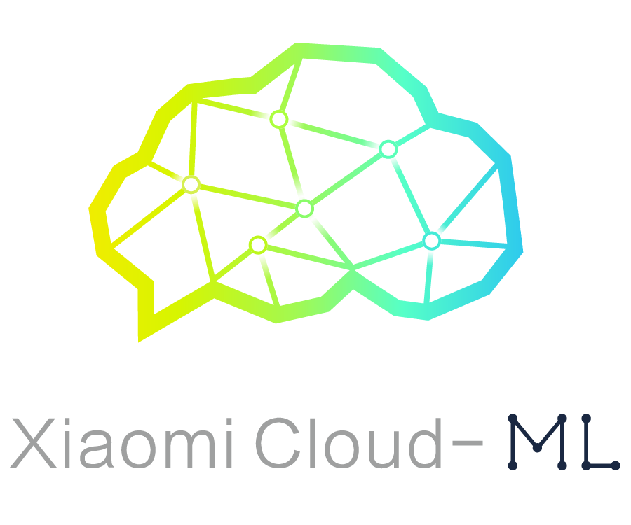

# Xiaomi Cloud-ML Python SDK


## Introduction

It is the SDK for Xiaomi Cloud-ML service, which allows developers to access the machine learning services easily.

For more information, please read the documents in <http://docs.api.xiaomi.com/cloud-ml/> .

## Components

* [cloud_ml_common](./cloud_ml_common) is the common package about signature.
* [cloud_ml_sdk](./cloud_ml_sdk) is the Python SDK and command-line client for Xiaomi Cloud-ML.
* [cloud_ml_samples](./cloud_ml_samples) are the sample projects for Xiaomi Cloud-ML.

## Installation

The Python packages have been uploaded to [pypi](https://pypi.python.org/pypi/cloud-ml-sdk) and you can install with `pip`. 

```
pip install cloud-ml-sdk
```

## Contribution

1. Fork the repo on GitHub.
2. Clone the project to your own machine.
3. Commit changes to your own branch.
4. Push your work back up to your fork.
5. Submit a Pull request so that we can review your changes.

